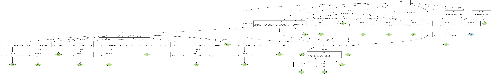

# MINI SHELL program
## Goal:
#### Creating a Mini Shell program Where the commands are parsed using lex and yacc. These commands are executed using C code.
## Structure Used
#### We Used a Command structure and Simple Command Structure found in `command.h` file. Where a Command is a list of simple commands in addition to there input and output files.
> This is how these structs look like
``` C
struct SimpleCommand {
	int _numberOfAvailableArguments;
	int _numberOfArguments;
	char ** _arguments;
	
	SimpleCommand();
	void insertArgument( char * argument );
};
```
``` C
struct Command {
	int _numberOfAvailableSimpleCommands;
	int _numberOfSimpleCommands;
	SimpleCommand ** _simpleCommands;
	char* _outFile;
	char* _inputFile;
	char* _errFile;
	int _background;
	int _out_new;

	void prompt();
	void print();
	void execute();
	void clear();
	
	Command();
	void insertSimpleCommand( SimpleCommand * simpleCommand );

	static Command _currentCommand;
	static SimpleCommand *_currentSimpleCommand;
};
```

## Lex
#### In the lex file we get tokens for our program. These are the tokens and what they are required for.
|    Token      |   Meaning  	|
| :-----------: | :----------:  |
| 	\n 	| new line  |
| [ \t]   | Spaces  |
| 	> 	| new output file |
| >>   | Append output file |
| 	<	| input file  |
| >&  | new output and error file  |
| 	>>&  	| Append output and error file  |
| &   | Background operation  |
| \|   | Pipeline  |
| [^ ><\|\t\n][^ ><\|\t\n]* | Word|
| . | Anything |

## YACC
#### We used the yacc to fill our structs and execute the commands when they are complete. Check shell.y file to get a better understanding of how we did this.
> This is the Graph representation of our yacc structure


## C Program
#### Eventhough we used yacc to execute the commands we need to have a C file to where those functions are written in and this C file will contain the functionality of all other files. Check command.c file to see the implementation.
> Only parts of the codes are explained to prevent ambiguity when looking at the code

#### When the Program the run we do 4 things: 
* Initialize Log file
* Check When child proccesses are finished to store there pid in Log file
* Check for CTRL C and prevent Termination
* Prompt for our first command then parse 
``` C
initLog();
signal(SIGCHLD, handle_chld);
signal(SIGINT, handler_function);
Command::_currentCommand.prompt();
```

#### In the Command Execute Function:
* Check if exit or cd Command
``` C
if ( _numberOfSimpleCommands == 1 ){
	if (strcmp(_simpleCommands[0]->_arguments[0], "exit") == 0) {
		bye();
	}
	if (strcmp(_simpleCommands[0]->_arguments[0], "cd") == 0) {
		if ( _simpleCommands[0]->_numberOfArguments) {
			strcat(path,"/");
			strcat(path, _simpleCommands[0]->_arguments[1]);
			if ( chdir(path) != 0 ) {
				printf("FAILED TO CHANGE DIRECTORY: %s\n", path);
			}
		}
		else {
			if ( chdir( getenv("HOME") ) != 0 ) {
				printf("FAILED TO CHANGE DIRECTORY /HOME");
			}
		}
		printf("cwd: %s\n", getcwd(path,300));
	}
}
```
* Change Input and Error File if required **(make sure to open the files using the correct modes and give right permissions)**
``` C
if (_inputFile != 0 ) {
	inp = open( _inputFile, O_RDONLY, 0666);
}
else {
	inp = dup( defaultin );
}

if ( _errFile != 0 ) {
	er = open( _errFile, O_WRONLY | O_CREAT | O_TRUNC, 0666);
}
else {
	er = dup( defaulterr );
}
dup2(er, 2);
``` 
#### In the following code we do 6 things:
1. Redirect input
2. Check if last command and send final output to required output by user **(File or Standard out)**
3. Direct output of last command to current command **(OUT_LAST == INPUT_NOW)**
4. Use `fork()` to Execute command
5. Close all open files and return standard IO
6. Check if not background operation use `waitpid()` to wait for all processes to finish
``` C	
int pid;
for (int i = 0; i < _numberOfSimpleCommands; i++) {
	dup2( inp, 0 );		// Redirect input 
	close ( inp );
	if ( i == _numberOfSimpleCommands -1 ) {
	// if last command direct to output file if exists
		if (_outFile != 0 ) {
			if ( _out_new ) 
				out = open( _outFile, O_WRONLY | O_CREAT | O_TRUNC, 0666);
			else
				out = open( _outFile, O_APPEND | O_WRONLY | O_CREAT, 0666); 	
		}
		else {
			out = dup( defaultout );
		}
	}
	else { // Direct to next command in pipeline
		int fdpipe[2];
		pipe( fdpipe );
		inp = fdpipe[0];
		out = fdpipe[1];
	}
	dup2( out, 1 );
	close( out );
	
	pid = fork();
	if ( pid == 0 ) {
		execvp(_simpleCommands[i]->_arguments[0], _simpleCommands[i]->_arguments);
		perror("EXECVP DIDN'T RUN CORRECTLY\n");
		exit( 0 );
	}
}
close( inp );
close( out );
close ( er );
dup2( defaultin, 0 );
dup2( defaultout, 1 );
dup2( defaulterr, 2 );
close( defaultin );
close( defaultout );
close( defaulterr );
if ( !_background ) {
	waitpid(pid, NULL, 0);
}
```
## Wildcards
#### In our wildcards we will use '*' to denote for any nonspace 0 or more characters and '?' for any nonspace one character.
#### For wildcards to work we need to change the arguments containing '*' or '?' into regular expressions. 
1. Pass the argument to a new function `wildcardArg` to check if wildcard before inserting argument
2. If it has '*' or '?' add '^' to begining of regex (reg) and iterate on each character in (a) to create regex:
``` C
char* r = reg;
while(*a){
		if(*a == '*'){
			*r = '.'; r++;
			*r = '*'; r++;
		}else if (*a == '?'){
			*r = '.'; r++;
		}else if (*a == '.'){
			*r = '\\'; r++;
			*r = '.'; r++;
		}else{
			*r = *a; r++;
		}
		a++;
	}
	*r='$'; r++; *r=0;
```
3. Use C library `regex.h` to create regex using `regex_t` and `regmatch_t` for matching
4. Use `dirent` library to open current directory
5. Finally we search for matches in the directories and insert using `simpleCommand->insertArument()`
## Using the Program
#### Start by executing `make` command in your terminal, a shell file is created type `./shell` to run the program.
> This is Video shows how to run some examples

